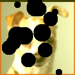

# PhotoFilters

## To Compile

Run the following command to compile

gcc FayFilters.c BmpProcessor.c PixelProcessor.c -lm -pthread -o reader

## To Run

Run the following command to run

./reader -i photos/test.bmp -o test3out.bmp -f c

## Parameter Definitions

-i is the input file.
-o is the name of the output file. Must contain .bmp extension.
-f is the filter type, choices are either c for swiss cheese or b for blur.

## Notes

Thread Count Defined under macro THREAD_COUNT (line 25 of Fay Filters) per instructions.
Program will exit if THREAD_COUNT is greater than Image Width.

## Example

